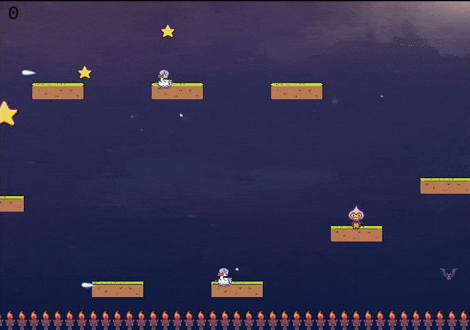

# RPG-game : Sky Mario

This is a Javascript Capstone project from Microverse Javascript curriculum. The project is building a web Game app using Phaser Game engine. The concept of inheritance is widely applied in this project, as it is required to extend defined classes fromm Phaser classes. 



## Description 
The game is a simpe famous mario like character Role Play Game (RPG), named Sky Mario. The sky mario character moves between two game world walls, by jumping from platform to platform and collects stars in his way, which adds score. 

### Sky Mario 
The sky mario is a sprite object, with Phaser physics support. It is affected by gravity, collision and overlap with other objects. It has animation properties with seven frames, three for left move, three for right move and one for turn move, which is controlled by left, right and up arrows in the keyboard.

### Platforms
Another entity in the game are patforms. There are physics arcade sprite objects which can interact with other objetcs like with sky mario. There are two types of pateforms, static and dynamic. The static patform doesn't move in any circumstance but when sky mario collides with it, it makes its y velocity zero. 
The other platform group are the dynamic platforms with immovable property. These physics group has fixed velocity but will not be affected by any sort of collision or overlap. This dynamic platform group bounces on wolrd boundaries. 

### The fire floor
The floor of the game world is a fire floor. If the player slipped over platforms and fall in to the fire floor it dies. 

### Enemies 
The enemies of star mario in this game are goose, and bat. 
The goose walks on moving platforms and it also shoots laser in the horizontal direction. It has animation property with left and right moves on the moving platforms. It can kill star mario with both overlap and with laser.
The bat is another object which has a fixed velocity and bounces on world bounds. It can kill sky mario on overlap.

### The stars
The stars are fixed objects in the game. When the sky mario collects them (overlap), scores will be added to the player. There are two big stars at the left and right wall of the game world. And both are created alternatively. If sky mario collects the right big star, another big star on the left wall and other set of small stars throughout will be created, eventually. 

## Game API
A game API with user generated keys is used to set and get player score when game is over. 


## Game Instruction 
- The game is a simple RPG game. The player can move the sky mario in left, right, and up direction with keyboard arrow keys. 
- The player should keep sky mario on the patforms, jumping from one to the other to reach the opposite wall of the game world, where a big Star is awaiting. This process repeats until sky mario dies and game is Over.
- The player should collect as many stars as possible on its way. The small stars add 10 scores while the large star adds 50.
- When the player collects the big star at one end, then another big star will be created on the opposite wall, so sky mario needs to go back to the opposite wall again to achieve more score 
- The player should keep sky mario away from enemies (goose, goose laser and bat).

[Video Link](https://www.loom.com/share/84724bf0eb9649bdafd3518a81cc54c0)

## Live demo
[Netlify](https://nostalgic-gates-d3f1b5.netlify.app/) 
## Built With

- Javascript
- Phaser Game Engine
- Axios  
- Jest 
- Babel

## Getting Started
The usage of this program is simple. 

### Prerequisites

- Javascript 
- Webpack 
- Phaser  

## Setup

### running with local server 
- git clone https://github.com/henatan99/RPG-game 
```bash
npm run build
```
```bash
npm run start
```

**For console test demonstrations below**
```bash
npm run test 
```
## Authors

👤 **Henok Mossissa**

- GitHub: [@henatan99](https://github.com/henatan99)
- Twitter: [@henatan99](https://twitter.com/henatan99)
- LinkedIn: [Henok Mossissa](https://www.linkedin.com/in/henok-mekonnen-2a251613/)

## :handshake: Contributing

Contributions, issues, and feature requests are welcome!

## Show your support

Give a :star:️ if you like this project!

## Acknowledgment 

- Phaser Game Engine contributors 

## :memo: License

This project is [MIT](./LICENSE) licensed.

